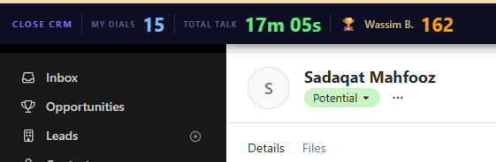

# Close CRM — Dials & Talk Time

A Chrome extension that pins a live stats bar to the top of every tab, pulling today's numbers directly from the Close CRM API every 7 seconds.



---

## Features

- **My Dials** — your outbound call count since midnight (your chosen timezone)
- **Total Talk** — cumulative talk time across all your calls today
- **🏆 Top Dialler** — who's leading the team right now, updated live
- **Timezone picker** — switch between UK, US, Dubai, Pakistan, Japan and more; resets the day boundary instantly
- **Minimisable** — collapse to a slim 30 px bar that still shows all three numbers
- **No proxy needed** — talks directly to the Close API from the browser

---

## Installation

1. Clone or download this repo
2. Open Chrome and go to `chrome://extensions`
3. Enable **Developer mode** (toggle top-right)
4. Click **Load unpacked** and select this folder
5. The bar will appear on every tab within a few seconds

> The extension requires the Close CRM API to be reachable. Make sure you are logged into a network that can reach `api.close.com`.

---

## How it works

| Component | What it does |
|---|---|
| `background.js` | Fetches the Close API on each ping; caches user names; resolves unknown user IDs individually |
| `content.js` | Injects the bar into every page; pings the background every 7 s to keep the service worker alive and trigger refreshes |
| `content.css` | Dark-themed bar styled to sit above any page without breaking layouts |
| `manifest.json` | Manifest V3; `host_permissions` for `api.close.com` only |

### Timezone-aware "today"

The start-of-day timestamp is calculated by probing noon UTC in the selected IANA timezone, deriving the DST-aware offset, and subtracting it from UTC midnight. This means the day boundary automatically adjusts for BST, EDT, etc.

### Top dialler

Instead of using the Close reporting API (which can return incomplete data for short date windows), the extension fetches **all** team outbound calls since midnight and counts them per `user_id` client-side — the same source of truth as Close's own leaderboard.

---

## Adding your screenshot

1. Take a screenshot of Chrome with the bar visible at the top
2. Save it as `screenshot.png` in this folder
3. Run:
   ```bash
   git add screenshot.png
   git commit -m "Add screenshot"
   git push
   ```

---

## Timezones supported

🇬🇧 UK · 🇺🇸 New York · 🇺🇸 Los Angeles · 🇨🇦 Toronto · 🇦🇪 Dubai · 🇵🇰 Pakistan · 🇪🇬 Egypt · 🇦🇺 Sydney · 🇯🇵 Japan · UTC
